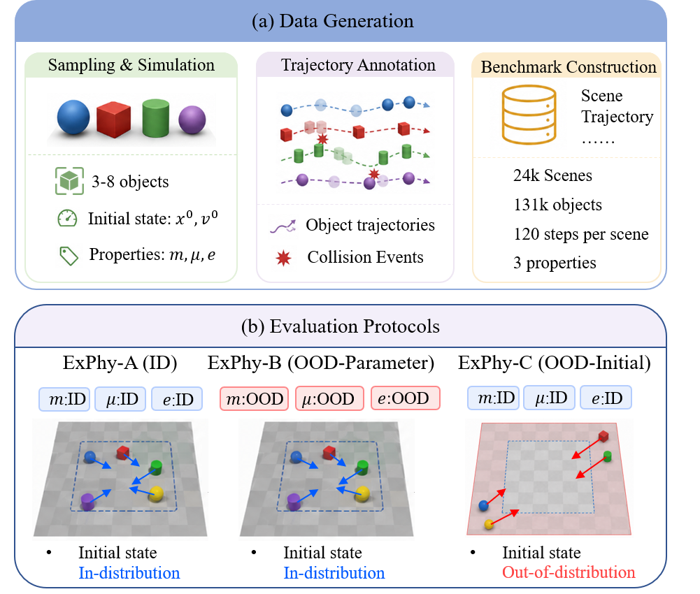
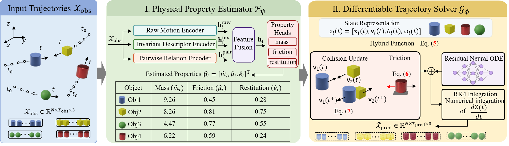
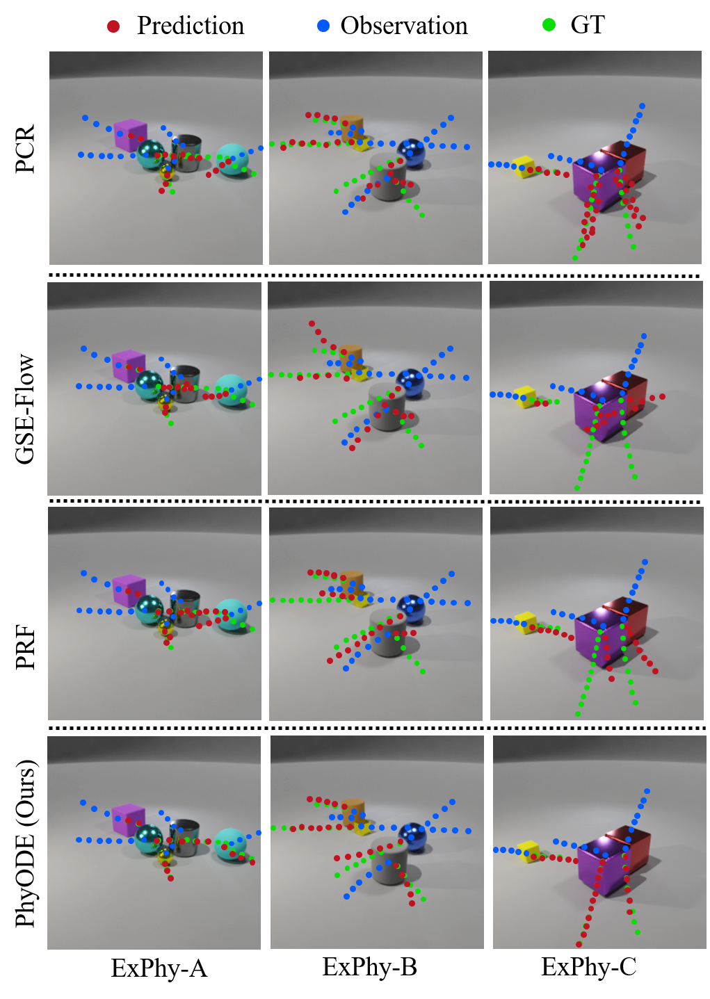

<div align="center" style="font-family: charter;">

<h1>ExPhy: A Benchmark for Explicit Physical Property Learning in Multi-Object Trajectory Forecasting</h1>

<!-- Add the ExPhy teaser (e.g., Figure 1 from the paper) after saving it as docs/teaser.png:
<div align="center">
  
</div>
<br />
-->

[](https://github.com/Zest86/ExPhy)
<!-- Add the arXiv badge here after the paper receives a public arXiv identifier. -->

<div>
    <a href="https://zest86.github.io/" target="_blank">Rui Wang</a><sup>1</sup>,
    Yeteng Wu<sup>1</sup>,
    Xianlin Zhang<sup>2</sup>,
    <a href="https://jueduilingdu.github.io/" target="_blank">Mengshi Qi</a><sup>1, *</sup>
</div>

<div>
    <sup>1</sup>State Key Laboratory of Networking and Switching Technology,<br />
    Beijing University of Posts and Telecommunications<br />
    <sup>2</sup>School of Digital Media &amp; Design Art,<br />
    Beijing University of Posts and Telecommunications
</div>

<p><sup>*</sup>Corresponding author</p>

<p align="justify"><i>
Understanding object dynamics requires not only predicting future trajectories but also examining whether a model captures the physical properties that govern motion. However, existing benchmarks rarely expose object-level physical properties as explicit evaluation targets alongside trajectory forecasting. To address this gap, we introduce <b>ExPhy</b>, a multi-object trajectory forecasting benchmark containing 24,000 simulated physical scenes with explicit object-level labels for mass, friction, and restitution. ExPhy provides observed and future trajectories together with an in-distribution (ID) split and two out-of-distribution (OOD) splits over physical parameters (OOD-Parameter) and initial states (OOD-Initial) for jointly evaluating trajectory forecasting and physical property estimation. We further instantiate <b>PhyODE</b>, a physics-guided model with an explicit property interface that estimates physical properties from observed trajectories and uses them for differentiable future rollout. On the long-horizon OOD-Initial setting, PhyODE reduces ADE and FDE by 33.1% and 31.0%, respectively, compared with the strongest baseline. Zero-shot evaluation on ComPhy further assesses cross-benchmark transfer. Property-level analyses reveal that accurate trajectory forecasting does not necessarily imply accurate recovery of the underlying physical properties.
</i></p>

</div>

## News

- **`2026-08`** :rocket: Initial release of the ExPhy benchmark and PhyODE baseline.

## Contents

- [Overview](#overview)
- [Benchmark](#benchmark)
- [Method](#method)
- [Results](#results)
- [Getting Started](#getting-started)
  - [Installation](#installation)
  - [Data Preparation](#data-preparation)
  - [Training and Evaluation](#training-and-evaluation)
- [Acknowledgement](#acknowledgement)
- [Citation](#citation)

## Overview

ExPhy is designed to answer two complementary questions:

1. Can a model accurately forecast the future trajectories of interacting objects?
2. Do its estimated physical properties agree with the simulator parameters that govern the motion?

Unlike benchmarks that supervise only future outcomes, ExPhy exposes continuous object-level labels for **mass**, **friction**, and **restitution**. This enables trajectory forecasting and explicit physical property learning to be evaluated within a unified protocol.

## Benchmark

ExPhy contains **24,000** simulated multi-object scenes generated with PyBullet. Each scene includes 3-8 interacting cubes, cylinders, or spheres, together with observed/future 3D trajectories and object-level physical property annotations.

| Split | Setting | Train | Validation | Test | Distribution shift |
|---|---|---:|---:|---:|---|
| ExPhy-A | In-distribution | 16,000 | 2,000 | 2,000 | None |
| ExPhy-B | OOD-Parameter | - | - | 2,000 | Mass, friction, and restitution |
| ExPhy-C | OOD-Initial | - | - | 2,000 | Initial locations and velocities |

All models are trained exclusively on ExPhy-A and evaluated directly on ExPhy-B and ExPhy-C without fine-tuning. We provide three observation-prediction protocols:

| Protocol | Observed steps | Predicted steps |
|---|---:|---:|
| Short | 10 | 10 |
| Mid | 20 | 40 |
| Long | 30 | 60 |


## Method

We introduce **PhyODE**, a physics-guided hybrid model with two main components:

- An explicit physical property estimator that combines raw motion, invariant trajectory, and pairwise relation features to predict object-level mass, friction, and restitution.
- A differentiable trajectory solver that combines property-conditioned friction and collision dynamics with a residual Neural ODE and RK4 integration.

Ground-truth physical properties are used only as training supervision and are never provided as inference inputs.



## Results

PhyODE achieves strong in-distribution, out-of-distribution, and cross-benchmark forecasting performance. In the Long setting, it obtains the following ADE/FDE results:

| Evaluation split | ADE | FDE |
|---|---:|---:|
| ExPhy-A (ID) | **0.36** | **0.75** |
| ExPhy-B (OOD-Parameter) | **0.40** | 0.85 |
| ExPhy-C (OOD-Initial) | **0.97** | **2.00** |
| ComPhy (zero-shot transfer) | **0.51** | **0.82** |

On ExPhy-C, PhyODE improves the Long-horizon ADE/FDE from 1.45/2.90 to 0.97/2.00. Property-level results further show that low trajectory error does not necessarily imply accurate physical property recovery, motivating joint evaluation of both dimensions.

<!-- Add the main ExPhy result visualization after saving it as docs/results.png:
<div align="center">
    
</div>
-->

## Getting Started

> [!NOTE]
> The paper specifies the benchmark protocol and training configuration, but not the final repository filenames or download URLs. Replace the marked placeholders below when the code and data packages are finalized.

### Installation

```bash
git clone https://github.com/Zest86/ExPhy.git
cd ExPhy
pip install -r requirements.txt
```

The experiments are implemented in PyTorch. The paper reports training and evaluation on a single NVIDIA RTX 3090 GPU.

### Data Preparation

Download the ExPhy data package and organize it as follows:

```text
data/
├── ExPhy-A/
│   ├── train/
│   ├── val/
│   └── test/
├── ExPhy-B/
│   └── test/
└── ExPhy-C/
    └── test/
```

<!-- Add the public dataset download link and exact preprocessing command here. -->

### Training and Evaluation

Models should be trained on ExPhy-A only and evaluated on ExPhy-A/B/C under the Short, Mid, and Long protocols. ExPhy-B and ExPhy-C must not be used for fine-tuning.

<!-- Replace these comments with the repository's exact commands, for example:
python train.py --config configs/phyode_long.yaml
python evaluate.py --config configs/phyode_long.yaml --split exphy_c
-->

The PhyODE configuration reported in the paper uses AdamW with a learning rate of `1e-4`, weight decay of `1e-5`, batch size `64`, and `50` training epochs.

## Acknowledgement

ExPhy is generated with the open-source [PyBullet](https://pybullet.org/) physics engine. We thank the authors of the physical reasoning and trajectory forecasting methods used in our benchmark comparisons.

## Citation

If you find ExPhy useful in your research, please consider giving this repository a star :star: and citing our work :pencil:

```bibtex
@article{wang2026exphy,
  title   = {ExPhy: A Benchmark for Explicit Physical Property Learning in Multi-Object Trajectory Forecasting},
  author  = {Wang, Rui and Wu, Yeteng and Zhang, Xianlin and Qi, Mengshi},
  journal = {arXiv preprint},
  year    = {2026}
}
```
